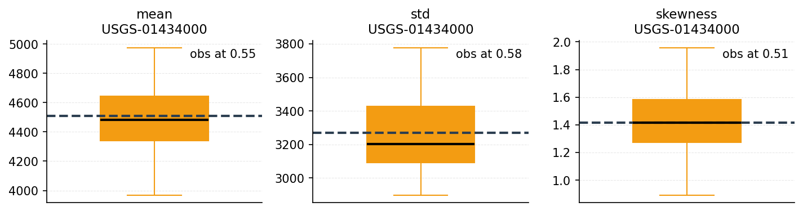
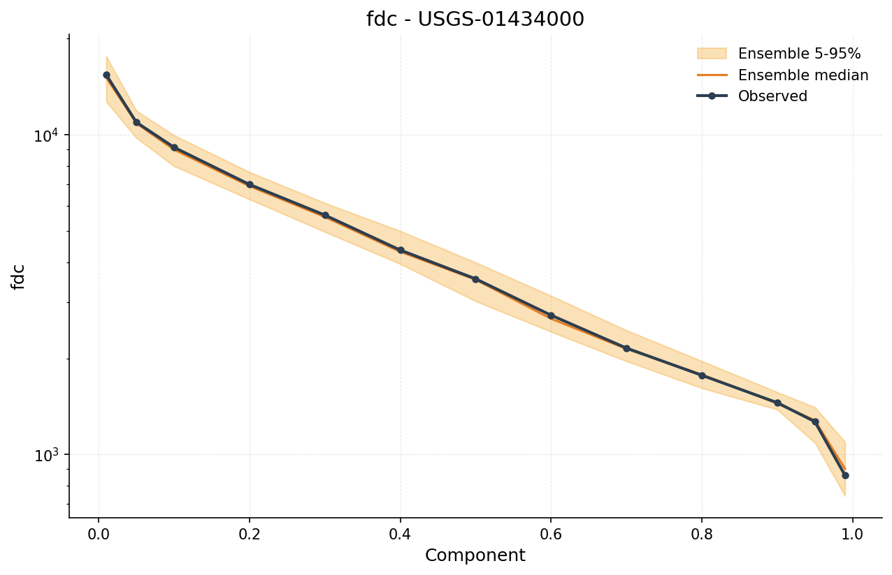
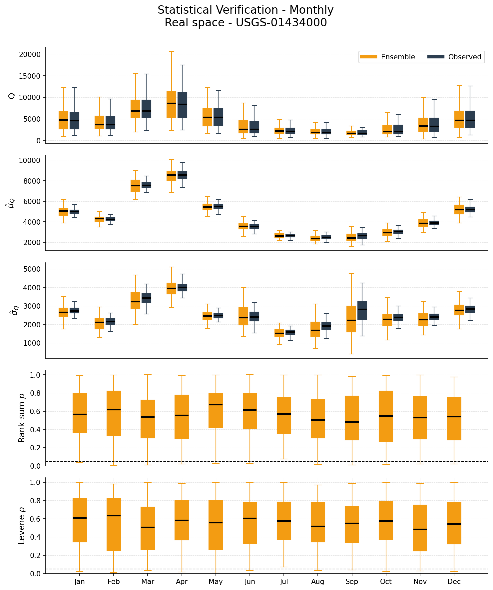

# Verification and Validation

After generating synthetic flows, two questions follow (Stedinger and
Taylor, 1982):

- **Verification**: does the ensemble reproduce the statistics the
  generator was designed to reproduce (moments, correlations,
  distributional shape)?
- **Validation**: does the ensemble reproduce characteristics the
  generator was not explicitly fit to, such as drought duration and
  severity?

`synhydro.verify` and `synhydro.validate` answer these with the same
reporting idiom: each statistic is computed once on the observed record
and once on every realization, and the observed value is compared
against the distribution of the statistic across realizations.

## Setup

```python
import synhydro

Q_daily = synhydro.load_example_data()
Q_monthly = Q_daily.resample("MS").sum()

gen = synhydro.KirschGenerator()
gen.fit(Q_monthly)
ensemble = gen.generate(n_realizations=100, n_years=50, seed=42)
```

## Run verification

Metric selection is explicit: pass `metrics="all"`, or a list of
category names, metric names, and callables. Categories:
`marginal`, `temporal`, `seasonal`, `annual`, `spatial`, `fdc`,
`lmoments`, `extremes`, `spectral`. See the
[verification API reference](../api/verification.md) for the full
metric table with citations.

```python
result = synhydro.verify(ensemble, Q_monthly, metrics="all")
```

```python
result = synhydro.verify(
    ensemble, Q_monthly,
    metrics=["marginal", "seasonal", "acf"],
)
```

## Read the summary

`result.summary()` returns one row per metric (and per component for
curve metrics such as monthly means), with the observed value, the
spread across realizations, and two consistency measures:

- `obs_percentile`: the observed value's position within the synthetic
  sample, `(n_below + 0.5 n_equal + 0.5) / (n + 1)`. Values near 0.5
  mean the observed statistic is central in the ensemble; values near
  0 or 1 mean it lies in the tail.
- `in_90_band`: whether the observed value falls between the ensemble's
  5th and 95th percentiles.

```python
summary = result.summary()
summary[summary["in_90_band"] == False]        # observed outside the ensemble band
summary[summary["obs_percentile"] < 0.05]      # ensemble overstates the statistic
```

`result.category_summary()` rolls the table up to one row per
(category, site), using only unit-free quantities so metrics with
different physical units are never averaged together. There is
deliberately no single overall score.

In a notebook, displaying `result` renders the summary as a styled
table with the percentile column shaded.

Metrics that could not be computed (for example daily-only low-flow
metrics on a monthly ensemble) are listed with reasons:

```python
result.skipped
```

For custom analysis, the per-realization values are available as a
tidy DataFrame with one row per (metric, site, component, realization):

```python
df = result.to_dataframe()
```

## Plot metric distributions

`plot_metric_distributions` shows each scalar metric as a boxplot
across realizations with the observed value as a dashed line, the
convention introduced by Stedinger and Taylor (1982):

```python
from synhydro.plotting import plot_metric_distributions, plot_metric_curve

fig, axes = plot_metric_distributions(result, metrics=["mean", "std", "skewness"])
```

{: width="700px" }

Curve metrics (flow duration curve, autocorrelation function, monthly
statistics) show an ensemble band with the observed curve overlaid:

```python
fig, ax = plot_metric_curve(result, "fdc", site=Q_monthly.columns[0])
```

{: width="600px" }

## The verification panel

`plot_verification_panel` produces a 5-panel figure comparing observed
and synthetic distributions by month, including per-realization
Wilcoxon rank-sum and Levene test p-values. Under a well-performing
generator, roughly 5 percent of realizations fall below the dashed
line at p = 0.05.

```python
from synhydro.plotting import plot_verification_panel

site = Q_monthly.columns[0]
fig, axes = plot_verification_panel(ensemble, observed=Q_monthly[site], site=site)
```

{: width="700px" }

!!! tip "Log-space comparison"
    Streamflow is often right-skewed. Comparing statistics of
    log-transformed flows can reveal differences in the lower tail:
    ```python
    fig, axes = plot_verification_panel(
        ensemble, observed=Q_monthly[site], log_space=True
    )
    ```

## Run validation (drought behavior)

`synhydro.validate` evaluates drought characteristics: run-theory
events below a flow threshold (`threshold_drought`) and events on the
Standardized Streamflow Index (`ssi_drought`). See the
[validation API reference](../api/validation.md).

```python
val = synhydro.validate(ensemble, Q_monthly, metrics="all")
val.summary()
```

Because drought statistics were not fit by the generator, this is the
stronger test: a generator can verify well and still understate
multi-year drought severity.

## Uncertainty and generator comparison

`bootstrap_metric_ci` puts confidence intervals on ensemble metric
estimates by resampling realizations:

```python
ci = synhydro.bootstrap_metric_ci(result, n_bootstrap=1000, seed=1)
```

`compare_methods` tests whether one generator reproduces observed
statistics better than another, using a paired bootstrap over
realizations:

```python
gen_b = synhydro.ThomasFieringGenerator()
gen_b.fit(Q_monthly[[site]])
ensemble_b = gen_b.generate(n_realizations=100, n_years=50, seed=42)

result_b = synhydro.verify(ensemble_b, Q_monthly[[site]], metrics="all")
comparison = synhydro.compare_methods(result, result_b, seed=1)
comparison[comparison["significant"]]
```

## Custom metrics

Any function of a series can join the suite:

```python
from synhydro.verification import register_metric

@register_metric(category="custom", units="flow")
def flow_q25(x):
    """25th percentile of flows."""
    return float(x.quantile(0.25))

result = synhydro.verify(ensemble, Q_monthly, metrics=["marginal", "flow_q25"])
```

## Next steps

- **Metric definitions and citations** - [Verification API](../api/verification.md)
  and [Validation API](../api/validation.md)
- **Algorithm details** can help diagnose which statistical properties a
  generator is designed to preserve - [Algorithms](../algorithms/index.md)

---

**Previous:** [Drought Analysis (SSI)](05_drought_analysis.md) | **Next:** [Plotting Walkthrough](07_plotting.md)
